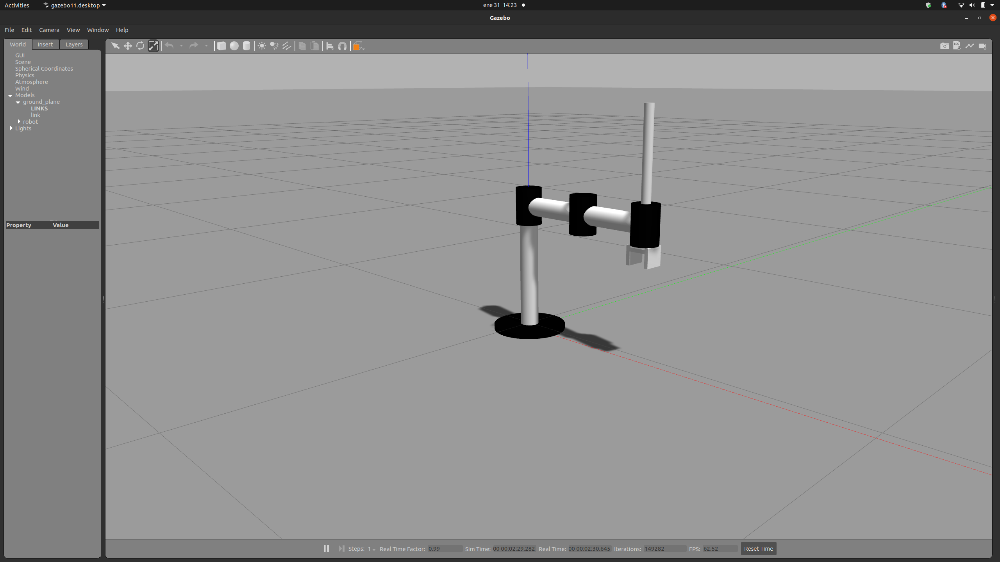

# Staubli TS60 Robot Simulation
|  |  |
|:-------------------------------:|:-------------------------------:|


## Overview
This repository contains the URDF model and simulation files for the 4DoF Staubli SCARA TS60 robot. The project utilizes the Robot Operating System (ROS) framework and Gazebo for simulation. The aim is to provide a detailed model of the robot, visualize it in RViz, and simulate its behavior in Gazebo.

## Repository Structure
```
scara_robot/
    ├── urdf/
    │   └── [URDF files defining the robot model]
    ├── launch/
    │   └── [Launch files for RViz and Gazebo]
    ├── config/
    │   └── [Configuration files for controllers]
    └── results/
        └── [Contains images of the simulation results.]
report - [Detailed documentation of the implementation]
```

## Getting Started
### Prerequisites
- ROS (Kinetic or newer)
- Gazebo
- RViz

### Installation
1. Clone the repository:
   ```bash
   git clone https://github.com/yourusername/TS60-Design-Sim.git
   cd TS60-Design-Sim
   ```
2. Build the workspace:
   ```bash
   catkin_make
   source devel/setup.bash
   ```

### Running the Simulation
1. Launch the robot in RViz:
   ```bash
   roslaunch scara_robot robot_rviz.launch
   ```
2. Launch the robot in Gazebo:
   ```bash
   roslaunch scara_robot joints.launch
   ```

### Controlling the Robot
- To send commands to the joint controllers:
  ```bash
  rostopic pub -1 /MJBot/joint_group_position_controller/command std_msgs/Float64MultiArray "data: [1.0, 0.0, 1.0, 2.0]"
  ```
- To retrieve joint states:
  ```bash
  rostopic echo -n 1 /MJBot/joint_states
  ```
- To get the transformation from base-link to gripper in RViz:
  ```bash
  rosrun tf tf_echo base_link gripper
  ```

## Results
Below are some images of the final simulation results:

|  |  |  |
|:--------------------------------:|:--------------------------------:|:--------------------------------:|
|  |  |  |

## Authors
- [Moses Chuka Ebere](https://github.com/MosesEbere)
- [Joseph Oloruntoba Adeola](https://github.com/adeola-jo)

## License
This project is licensed under the MIT License - see the LICENSE file for details.

---
